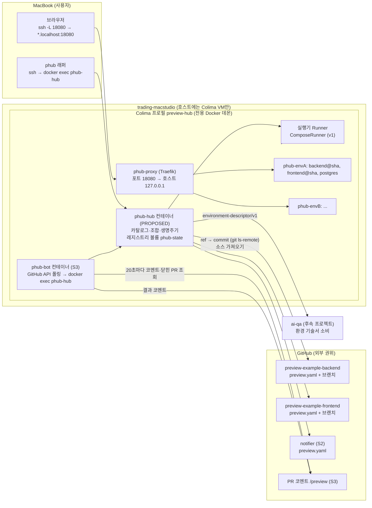
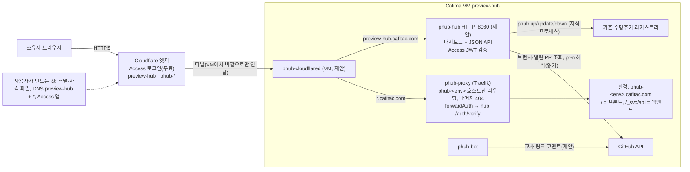

# Context map

- Authority: GitHub owns code and refs; the hub owns environment identity, pinned commits and lifecycle state; the Docker daemon of the `preview-hub` Colima VM owns running objects, which the hub reconciles by label.
- Host footprint: only the Colima VM. The hub, its registry and caches, the proxy, every environment and (S3) the bot runner are containers or named volumes inside the VM; the host sees one forwarded port bound to 127.0.0.1.
- Upstream/downstream: example repositories are upstream (read only). ai-qa is downstream and only reads the descriptor and writes its own report; it never mutates environments through the hub in v1.
- Genuine external boundaries: `GitSource` (git/GitHub), `Runner` (Docker/Compose), `GitHubApi` (S3 bot: list comments, list closed PRs, read PR head, post comment). No other adapter layers.
- The bot is outbound-only: GitHub never connects to the VM.

## Revision 4 (S4) — public access and dashboard

- Cloudflare is an external authority owned by the user; the hub never writes to it.
- The dashboard is a second entry point into the same lifecycle (next to the CLI and the bot); it adds no new state authority.
- GitHub gains read calls from `phub-hub` (listing, `pr-<n>`); writes remain in `phub-bot`.
