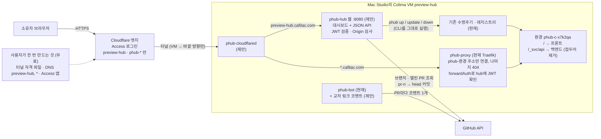
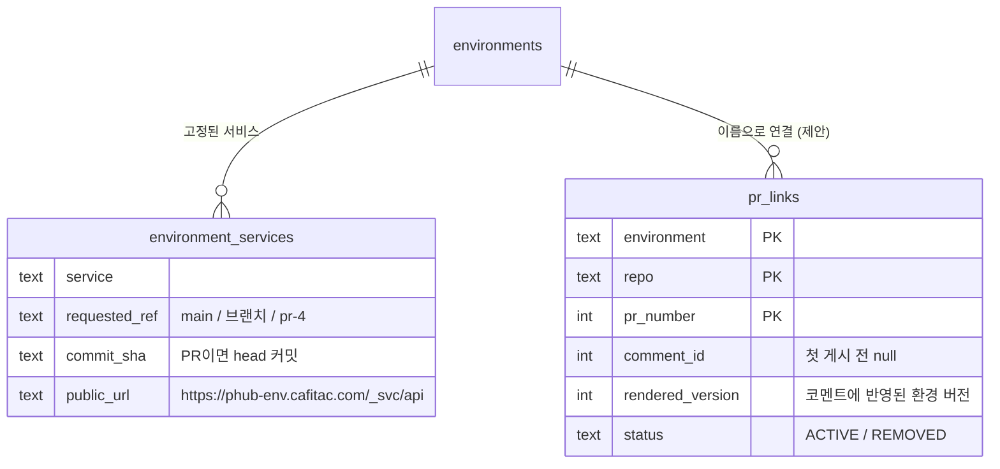
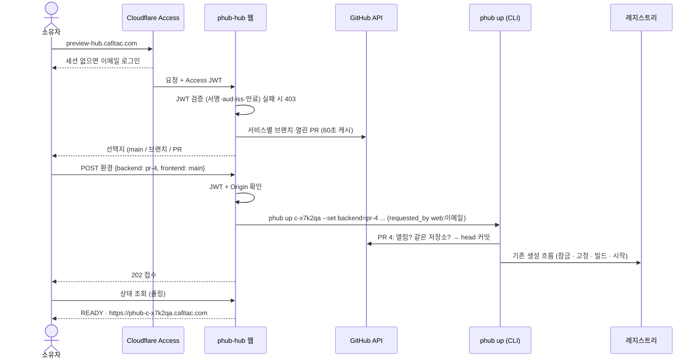
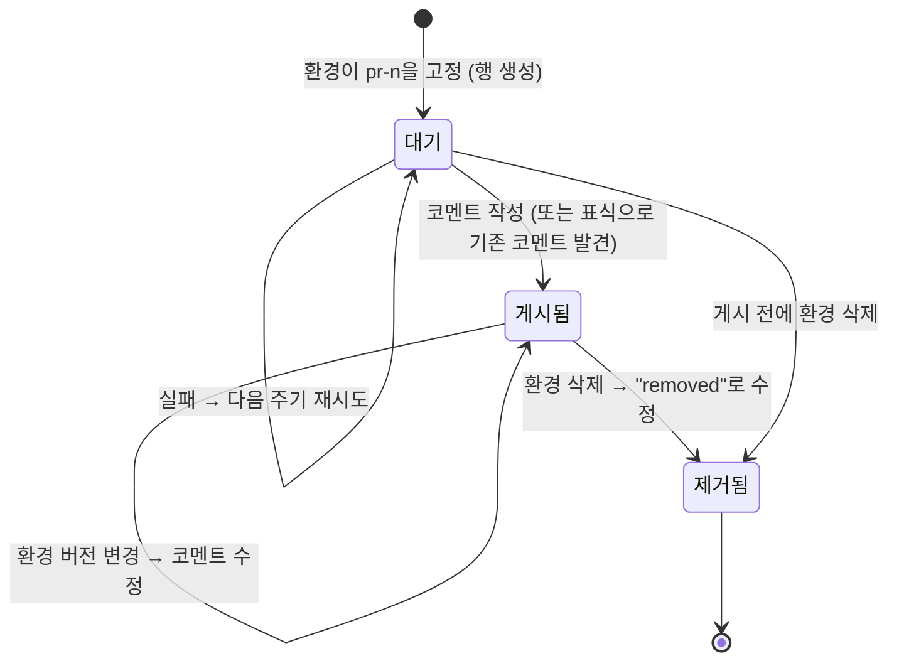
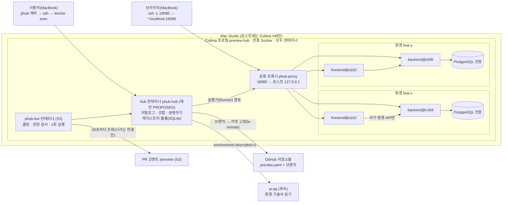
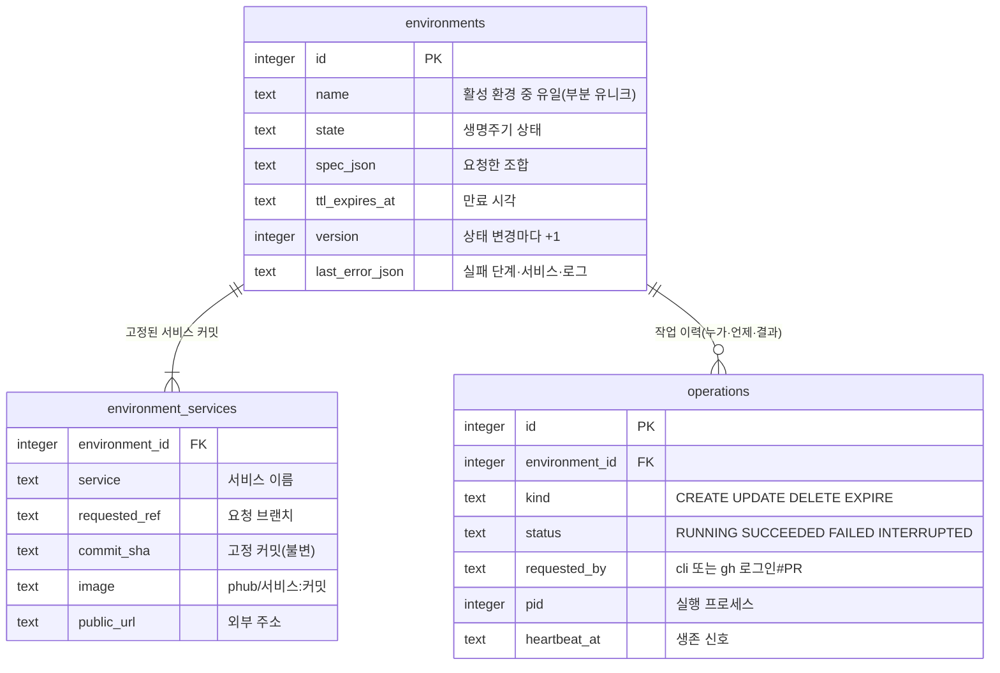
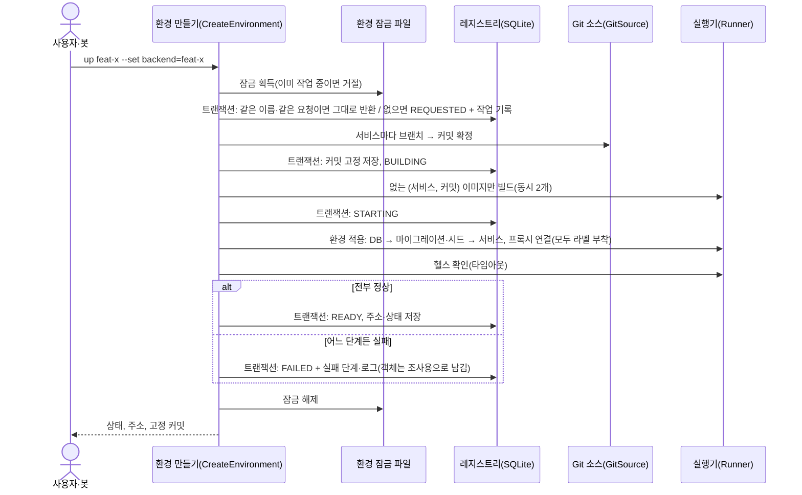
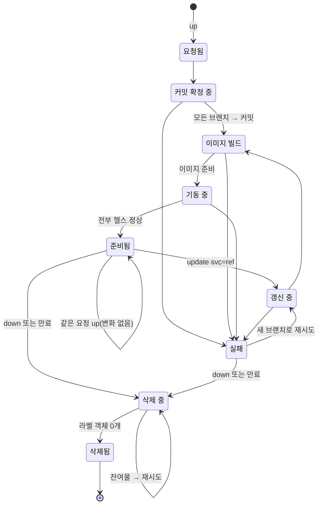
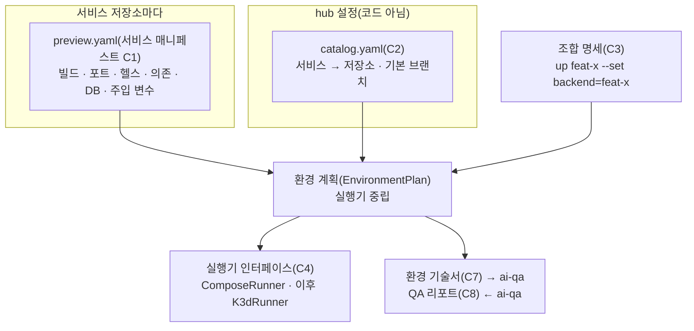
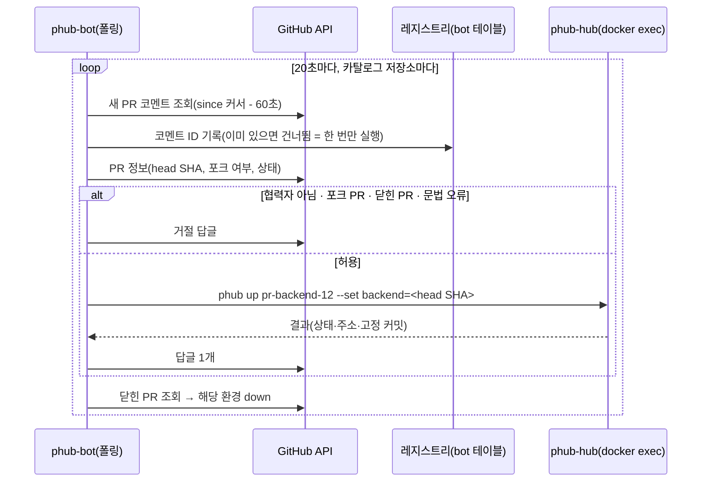

# 설계 검토

- 기능 / 범위: preview-hub v1 — 여러 저장소의 서비스를 브랜치별로 고정해 한 환경으로 띄우기. 이번 검토 대상은 rev4(S4: 대시보드·PR 조합·공개 접속); S1~S3 내용은 아래에 그대로 둠
- 근거 상태: 현재(CURRENT) / 제안(PROPOSED) / 미결정(OPEN)
- 기준 산출물: `01-context-map.md`, `02-domain-model.puml`, `04-target-schema.dbml`, `05-transaction-flows.puml`, `06-state-machines.puml`, `07-consistency-migration.md`, `08-acceptance-trace.md`, `11-interface-contracts.md`
- 검토 언어: 한국어
- 표현 원칙: TARGET_OVERVIEW_FIRST

## 한눈에 보는 최종 구조 (rev4 · S4 대시보드와 공개 접속)

- 현재(CURRENT): 환경은 CLI나 PR 코멘트로만 만들고, `*.localhost:18080` 주소를 SSH 포워딩으로만 연다. 서비스마다 주소가 따로다(`app.<환경>`, `api.<환경>`).
- 완성 후(PROPOSED): `https://preview-hub.cafitac.com` 대시보드에서 서비스마다 main·브랜치·열린 PR 중 하나를 골라 환경을 만든다. 환경은 `https://phub-<환경>.cafitac.com` 주소 하나로 열리고 API는 같은 주소의 `/_svc/api` 아래로 붙는다. 로그인은 Cloudflare Access(무료)가 맡고, hub가 한 번 더 확인한다. PR 번호로 조합하면 해당 PR마다 링크 코멘트가 하나씩 달린다.
- 안전 경계: VM 안 `phub-cloudflared`가 바깥으로만 연결한다(들어오는 포트 없음). hub에는 Cloudflare 토큰이 없다. Access 설정이 빠지거나 잘못돼도 hub가 JWT를 검증하므로 열리지 않는다(검증 설정이 없으면 전부 거절). 포크 PR과 닫힌 PR은 빌드하지 않는다.

### 전체 목표 구조 (rev4)

근거: `01-context-map.md` rev4, `11-interface-contracts.md` C2·C9·C10

- 대시보드는 수명주기를 새로 구현하지 않고 CLI를 그대로 부른다. 그래서 잠금·용량 제한·기록이 CLI·봇과 똑같다.
- 주소를 환경당 하나로 둔 이유: Access 로그인 쿠키는 주소(호스트)마다 따로라서, 프론트가 다른 호스트의 API를 부르면 로그인 화면으로 튕기고 CORS 오류가 난다.

### 목표 데이터 구조 (rev4 추가분)

근거: `04-target-schema.dbml` (마이그레이션 0003, 추가만)

- `pr_links`의 기본키 (환경, 저장소, PR)가 "PR마다 코멘트 하나"를 보장한다. 쓰는 쪽은 `phub-bot` 하나뿐이다.

### 핵심 흐름 — 대시보드에서 PR로 환경 만들기

근거: `05-transaction-flows.puml` rev4

### 상태 — PR 교차 링크 코멘트

근거: `06-state-machines.puml` rev4

### rev4 전달 참고 (보조 정보, 잠정)

| 단위 | 내용 | 수용 기준 |
|---|---|---|
| U10 | GitHub 클라이언트 공용화, `pr-<n>` 해석 | A11 |
| U11 | 환경당 한 주소 라우팅, JWT 검증·forwardAuth, cloudflared 서비스, 자격 파일 설치 스크립트 | A12, A13 (단위) |
| U12 | 대시보드 + JSON API | A10 (단위) |
| U13 | 교차 링크 코멘트, 마이그레이션 0003 | A14 |
| U14 | 공개 경로 실제 E2E + 회귀 | A10, A12~A15 실제 |

- 사용자 작업(U14 전): 터널 생성 후 자격 파일 설치, DNS `preview-hub`·`*` 레코드, Access 앱과 본인 이메일 허용 정책. 모두 무료.

## rev1~3 구조 요약

- 현재: 아무것도 없음(신규). Mac Studio는 Colima 프로필마다 Docker가 따로 도는 구조이고, 디스크 여유 44 GiB.
- 완성 후: Mac Studio 호스트에는 Colima 가상 머신 하나만 있고, 그 안에서 모든 것이 컨테이너로 돈다. hub 컨테이너(`phub-hub`)가 저장소별 `preview.yaml`과 카탈로그만 읽고 브랜치를 커밋으로 고정해 환경별 Compose 프로젝트(서비스 + 전용 PostgreSQL)를 띄운다. 공용 프록시가 `api.<환경>.localhost:18080` 이름으로 연결하고, MacBook은 SSH 포트 포워딩으로 접속한다.
- 안전 경계: hub는 자기가 떠 있는 VM의 Docker에만 닿는다(다른 프로젝트 데몬은 보이지 않음). 레지스트리·소스 캐시도 VM 안 볼륨이라 호스트 파일을 쓰지 않는다. 삭제는 `dev.phub.env` 라벨로만. 환경 5개·빌드 동시 2개·디스크 여유 하한으로 호스트를 지킨다. VM을 지우면 흔적이 남지 않는다.

## 시각화

### 전체 목표 구조

근거: `01-context-map.md`, `07-consistency-migration.md`

같은 프론트 커밋(`a1b2`)이 두 환경에서 서로 다른 백엔드에 붙는 것이 핵심 가치 1이다. 이미지는 커밋당 한 번만 빌드하고, 백엔드 주소는 빌드가 아니라 **컨테이너 시작 시 주입**하기 때문에 가능하다.

### 목표 데이터 구조

근거: `04-target-schema.dbml`

### 핵심 트랜잭션 흐름 — 환경 만들기

근거: `05-transaction-flows.puml`

DB 트랜잭션은 매번 짧게 끝나고, git·빌드·기동 같은 오래 걸리는 외부 작업은 **환경 잠금만 쥔 채** 트랜잭션 밖에서 한다. 프로세스가 도중에 죽으면 다음 명령이 오래된 작업 기록을 INTERRUPTED로 바꾸고 환경을 FAILED로 둔다. 삭제는 레지스트리가 아니라 Docker 라벨 기준이라 고아 객체가 남지 않는다.

### 도메인 상태와 권한 — 환경 생명주기

근거: `06-state-machines.puml`, `07-consistency-migration.md`

### 계약 요약 (확장성 = 핵심 가치 2)

근거: `11-interface-contracts.md`

세 번째 서비스(notifier)를 붙일 때 바뀌는 것은 **그 저장소의 `preview.yaml`과 카탈로그 한 줄**뿐이다. 백엔드는 `requires: notifier (optional)`로 선언해 두어, notifier가 없는 환경에서도 그대로 뜬다.

### PR 코멘트 봇 흐름 (rev3)

근거: `05-transaction-flows.puml`(bot 페이지), `07-consistency-migration.md`, `11-interface-contracts.md` C6

봇은 GitHub으로 **나가는 연결만** 쓰므로 호스트·네트워크 설정을 바꾸지 않는다. 저장소 목록은 카탈로그에서 가져오니, 서비스를 추가하면 봇도 자동으로 그 저장소를 본다. 토큰은 사용자가 만든 fine-grained 토큰을 VM 안 Docker secret으로만 둔다.

## 전달 계획 참고 (보조 정보)

| 순서 | PR 단위(가칭) | 담당 설계 범위 | 검증 / 관찰 | 롤백 경계 |
|---|---|---|---|---|
| 1 | U-BE 예제 백엔드 | C1 매니페스트, DB·시드, `/healthz` | 저장소 CI | 저장소 단위 |
| 2 | U-FE 예제 프론트 | C1, 런타임 설정 주입 | 저장소 CI | 저장소 단위 |
| 3 | U-CORE hub 계약·레지스트리·생명주기 | C2~C5, 스키마, 상태 흐름, FakeRunner | 단위 테스트 A1 A4 A5 A7 | 저장소 단위 |
| 4 | U-RUN ComposeRunner·프록시·hub 컨테이너·Colima 프로필 | 격리, 라벨 정리, SSH 포워딩 접속 | Mac Studio E2E A1~A5 | `phub down` + 프로필 삭제 |
| 5 | U-N notifier (S2) | 확장성 | E2E A6, hub diff 0 | 카탈로그 한 줄 제거 |
| 6 | U8 봇 · U9 실제 PR E2E (S3) | C6, bot 테이블, 폴링·권한·중복 방지 | 단위 테스트 + 실제 PR A9 | 봇 컨테이너 중지, 마이그레이션 0002는 추가만 |
| 7 | U-QA 기술서·리포트 스키마 (S4) | C7 C8 | 스키마 테스트 A8 | 저장소 단위 |

## 확인이 필요한 결정

- 이 설계(호스트에는 Colima VM만·나머지 전부 컨테이너, VM 안 볼륨의 SQLite 레지스트리, 커밋 고정·시작 시 주입, 라벨 기반 정리, `*.localhost` 이름 + SSH 포트 포워딩, 계약 C1~C8)를 승인하고 자율 진행 범위(스프린트 매니페스트) 작성으로 넘어갈지, 수정할지, 멈출지.
- rev3: O2(PR 봇 연결 방식)를 폴링 봇으로 확정했다(사용자 선택 A). 봇용 fine-grained 토큰은 사용자가 만들어 VM 안 secret으로 넣는다.
- O1(접속 방법)은 SSH 포트 포워딩으로 확정했다. Tailscale 컨테이너는 필요할 때 추가하며 공개 주소 템플릿만 바뀐다. O2(개인 계정 PR 봇 러너 등록)는 S3 계획 때 정한다.

### rev4에서 확인이 필요한 결정

- 대시보드 공개 경로의 자동 E2E는 Access를 통과할 자격이 없어 (1) VM 안에서 Host 헤더로 라우팅 확인, (2) 로그인 없이 공개 주소 요청 시 Access로 넘어가는지 확인, (3) 소유자가 브라우저로 한 번 직접 확인하는 방식으로 한다. 자동화용 Access 서비스 토큰은 나중으로 미룬다(O4).

