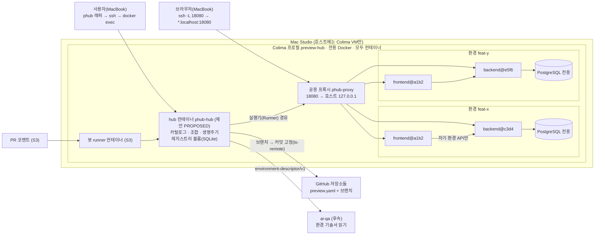
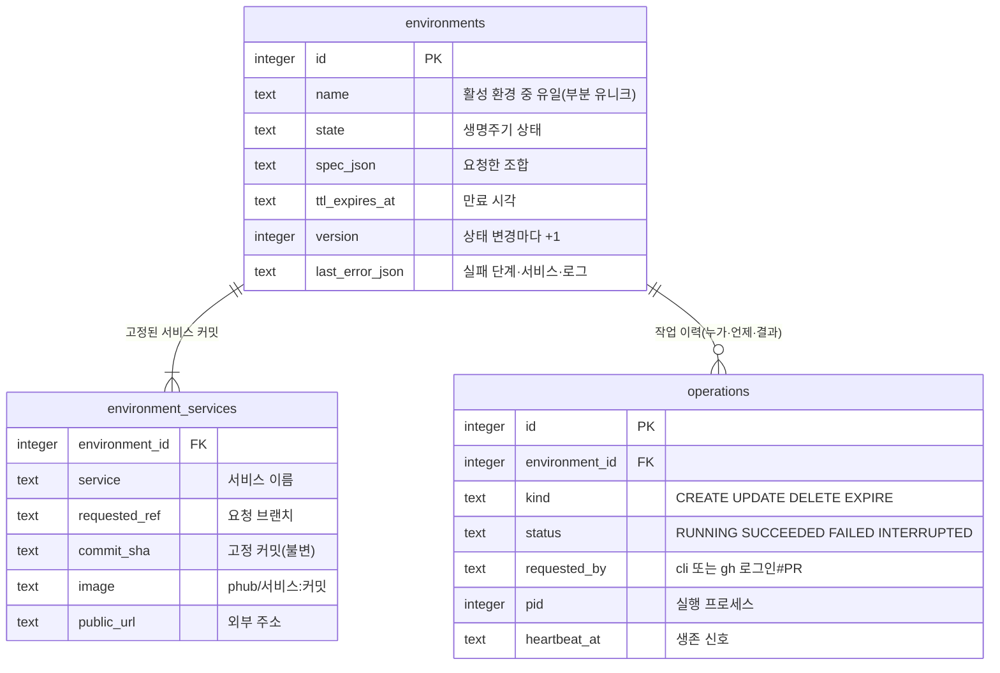
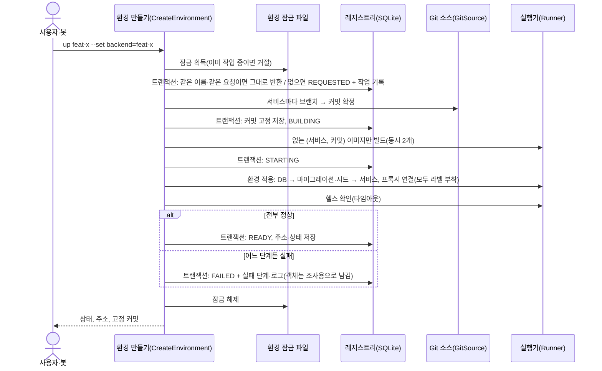
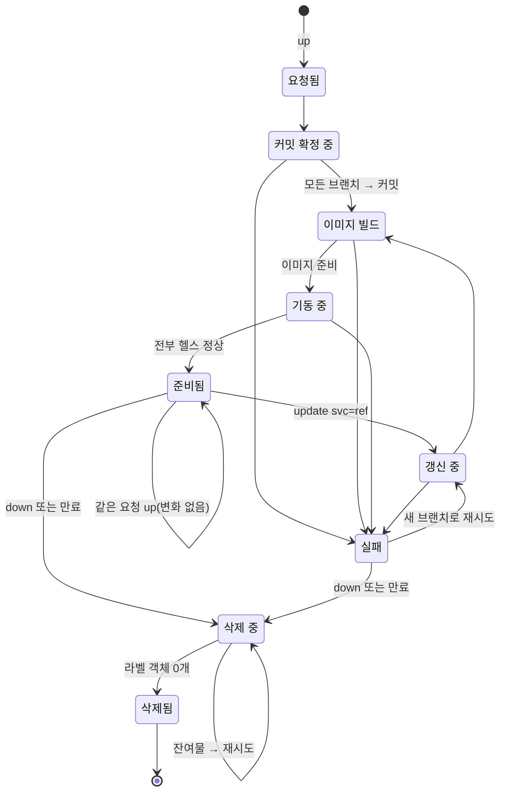
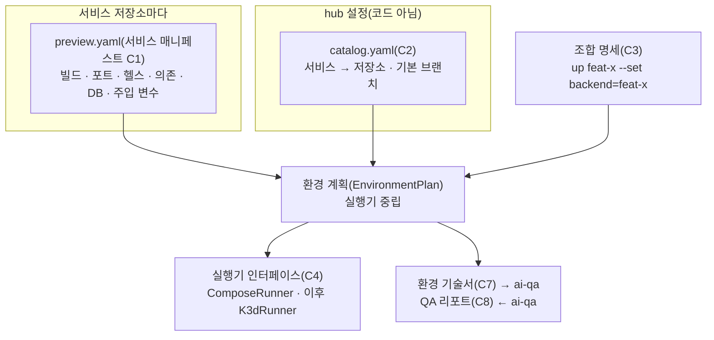

# 설계 검토

- 기능 / 범위: preview-hub v1 — 여러 저장소의 서비스를 브랜치별로 고정해 한 환경으로 띄우기 (S1~S4 계약, S1 구현 기준)
- 근거 상태: 현재(CURRENT) / 제안(PROPOSED) / 미결정(OPEN)
- 기준 산출물: `01-context-map.md`, `02-domain-model.puml`, `04-target-schema.dbml`, `05-transaction-flows.puml`, `06-state-machines.puml`, `07-consistency-migration.md`, `08-acceptance-trace.md`, `11-interface-contracts.md`
- 검토 언어: 한국어
- 표현 원칙: TARGET_OVERVIEW_FIRST

## 한눈에 보는 최종 구조

- 현재: 아무것도 없음(신규). Mac Studio는 Colima 프로필마다 Docker가 따로 도는 구조이고, 디스크 여유 44 GiB.
- 완성 후: Mac Studio 호스트에는 Colima 가상 머신 하나만 있고, 그 안에서 모든 것이 컨테이너로 돈다. hub 컨테이너(`phub-hub`)가 저장소별 `preview.yaml`과 카탈로그만 읽고 브랜치를 커밋으로 고정해 환경별 Compose 프로젝트(서비스 + 전용 PostgreSQL)를 띄운다. 공용 프록시가 `api.<환경>.localhost:18080` 이름으로 연결하고, MacBook은 SSH 포트 포워딩으로 접속한다.
- 안전 경계: hub는 자기가 떠 있는 VM의 Docker에만 닿는다(다른 프로젝트 데몬은 보이지 않음). 레지스트리·소스 캐시도 VM 안 볼륨이라 호스트 파일을 쓰지 않는다. 삭제는 `dev.phub.env` 라벨로만. 환경 5개·빌드 동시 2개·디스크 여유 하한으로 호스트를 지킨다. VM을 지우면 흔적이 남지 않는다.

## 시각화

### 전체 목표 구조

근거: `01-context-map.md`, `07-consistency-migration.md`

같은 프론트 커밋(`a1b2`)이 두 환경에서 서로 다른 백엔드에 붙는 것이 핵심 가치 1이다. 이미지는 커밋당 한 번만 빌드하고, 백엔드 주소는 빌드가 아니라 **컨테이너 시작 시 주입**하기 때문에 가능하다.

### 목표 데이터 구조

근거: `04-target-schema.dbml`

### 핵심 트랜잭션 흐름 — 환경 만들기

근거: `05-transaction-flows.puml`

DB 트랜잭션은 매번 짧게 끝나고, git·빌드·기동 같은 오래 걸리는 외부 작업은 **환경 잠금만 쥔 채** 트랜잭션 밖에서 한다. 프로세스가 도중에 죽으면 다음 명령이 오래된 작업 기록을 INTERRUPTED로 바꾸고 환경을 FAILED로 둔다. 삭제는 레지스트리가 아니라 Docker 라벨 기준이라 고아 객체가 남지 않는다.

### 도메인 상태와 권한 — 환경 생명주기

근거: `06-state-machines.puml`, `07-consistency-migration.md`

### 계약 요약 (확장성 = 핵심 가치 2)

근거: `11-interface-contracts.md`

세 번째 서비스(notifier)를 붙일 때 바뀌는 것은 **그 저장소의 `preview.yaml`과 카탈로그 한 줄**뿐이다. 백엔드는 `requires: notifier (optional)`로 선언해 두어, notifier가 없는 환경에서도 그대로 뜬다.

## 전달 계획 참고 (보조 정보)

| 순서 | PR 단위(가칭) | 담당 설계 범위 | 검증 / 관찰 | 롤백 경계 |
|---|---|---|---|---|
| 1 | U-BE 예제 백엔드 | C1 매니페스트, DB·시드, `/healthz` | 저장소 CI | 저장소 단위 |
| 2 | U-FE 예제 프론트 | C1, 런타임 설정 주입 | 저장소 CI | 저장소 단위 |
| 3 | U-CORE hub 계약·레지스트리·생명주기 | C2~C5, 스키마, 상태 흐름, FakeRunner | 단위 테스트 A1 A4 A5 A7 | 저장소 단위 |
| 4 | U-RUN ComposeRunner·프록시·hub 컨테이너·Colima 프로필 | 격리, 라벨 정리, SSH 포워딩 접속 | Mac Studio E2E A1~A5 | `phub down` + 프로필 삭제 |
| 5 | U-N notifier (S2) | 확장성 | E2E A6, hub diff 0 | 카탈로그 한 줄 제거 |
| 6 | U-BOT PR 봇 (S3) | C6 | 실제 PR A9 | 워크플로 제거 |
| 7 | U-QA 기술서·리포트 스키마 (S4) | C7 C8 | 스키마 테스트 A8 | 저장소 단위 |

## 확인이 필요한 결정

- 이 설계(호스트에는 Colima VM만·나머지 전부 컨테이너, VM 안 볼륨의 SQLite 레지스트리, 커밋 고정·시작 시 주입, 라벨 기반 정리, `*.localhost` 이름 + SSH 포트 포워딩, 계약 C1~C8)를 승인하고 자율 진행 범위(스프린트 매니페스트) 작성으로 넘어갈지, 수정할지, 멈출지.
- O1(접속 방법)은 SSH 포트 포워딩으로 확정했다. Tailscale 컨테이너는 필요할 때 추가하며 공개 주소 템플릿만 바뀐다. O2(개인 계정 PR 봇 러너 등록)는 S3 계획 때 정한다.
